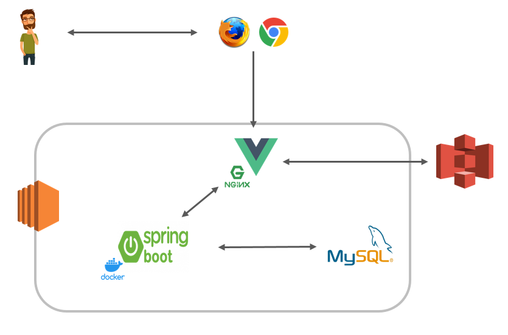
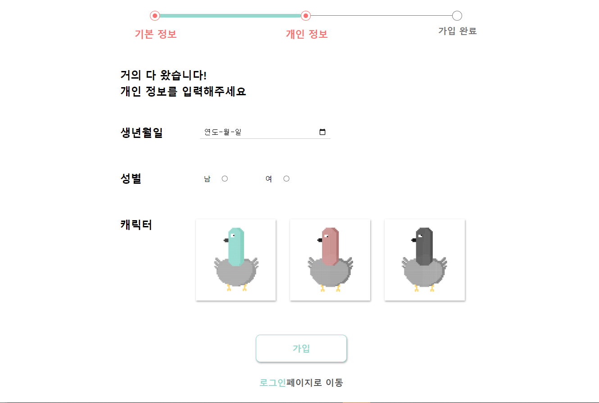
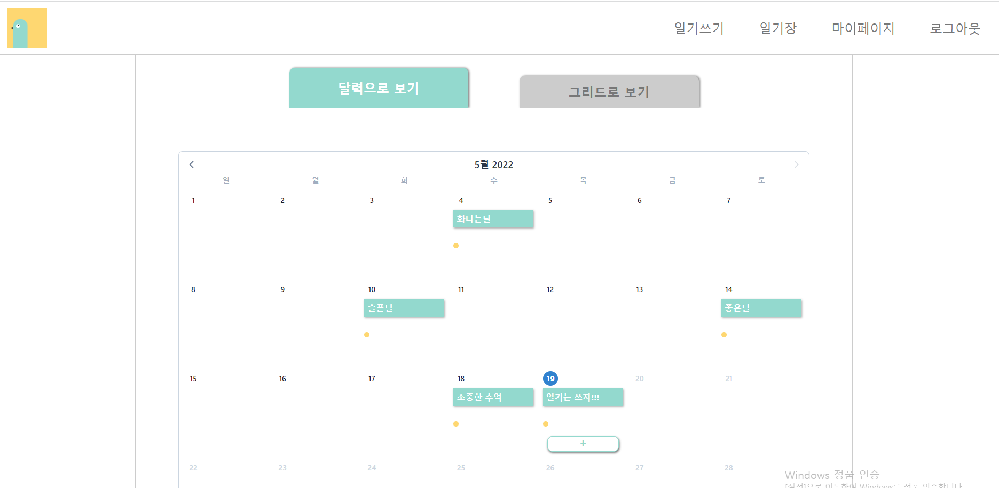
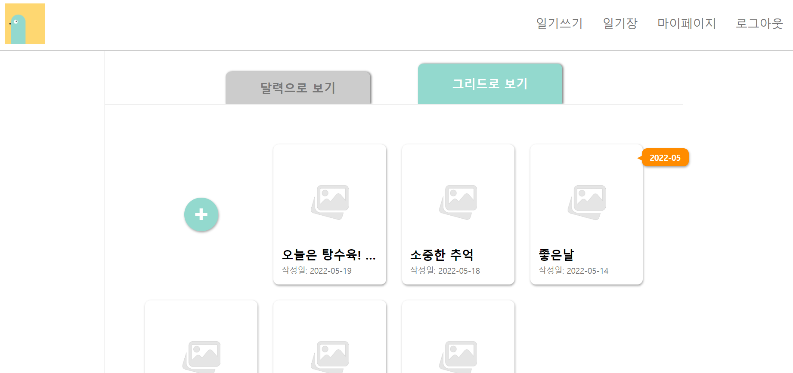
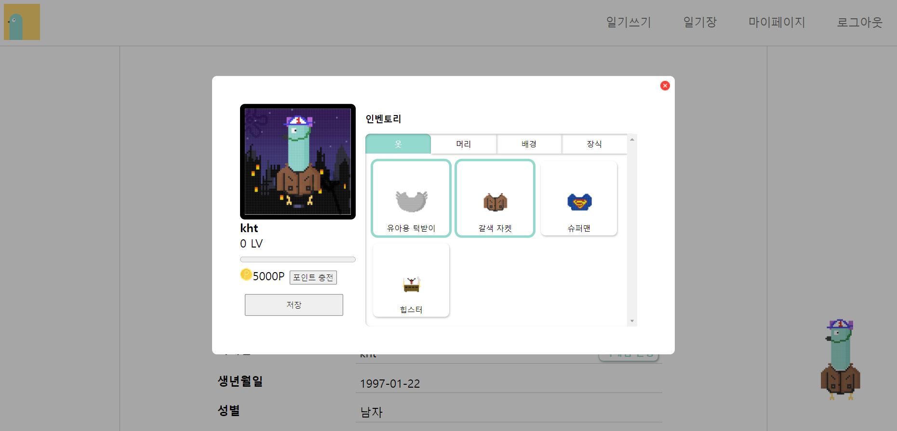

# 다이어리 키우기(DaKi)

> 쉽고 편리하게, 자유롭게 일기를 꾸미는 것을 모토로 나만의 일기장을 꾸밀 수 있는 서비스 DAKI
>
> 여러분의 하루를 다이어리 키우기에서 장식해보는 건 어떨까요? 

## 

## 기획 배경

- 일기 작성에 어려움을 느끼는 사람들을 위한 서비스를 개발하고 싶다.
    - 일기 쓸 시간이 없는 바쁜 현대인을 위해
    - 일기를 예쁘게 꾸미고 싶지만 손재주가 부족한 사람을 위해
    
    

## 주요 서비스

- 일기 작성
    - 일기를 작성하고 스티커나 이미지를 활용하여 꾸밀 수 있다.
    - 음성 인식을 이용하여 일기를 작성할 수 있다.
    - 달력으로 일기 작성한 날짜를 볼 수 있다.
    - 모바일 최적화를 통해 모바일로도 일기 작성이 가능하다.
- 캐릭터 꾸미기
    - 일기 작성을 통해 얻은 포인트로 캐릭터를 꾸미는 아이템을 얻을 수 있다.
    - 아이템을 입혀 캐릭터를 꾸밀 수 있다.
    
    

## 아키텍쳐




## 서비스 화면

### 1. 메인페이지


### 2. 로그인


### 3. 회원가입




### 4. 일기 캘린더



### 5. 일기 그리드



### 6. 일기 작성 페이지


### 7. 마이페이지


### 8. 캐릭터 팝업




## UCC [🔗]( https://youtu.be/1FPh0LBchYs)

 https://youtu.be/1FPh0LBchYs


## 기술 스택

| 구분 | S/W | version | 비고 |
| --- | --- | --- | --- |
| Server | ubuntu | Ubuntu 20.04.3 LTS |  |
|  | Docker | 20.10.14 |  |
| AWS | EC2 |  |  |
|  | S3 |  | 클라이언트 업로드 이미지 저장 |
|  | Route 53 |  |  |
| Database | MySQL | 5.7.37 |  |
| Backend | Java | 1.8 |  |
|  | Spring boot | 2.6.4 |  |
| Frontend | Vue.js      | 2.6.14             |                               |
|  | npm         |                    |                               |
| IDE | VS code | 1.66.0 |  |
|  | IntelliJ | 20213.1 |  |
| Cooperation | Jira |  |  |
|  | Notion |  |  |
| version control | Git |  |  |


## 포팅 메뉴얼

### 1. 프로젝트 빌드 전 설치요소(특이사항)

#### 1-1. 방화벽 설정

서비에서 사용할 포트를 미리 열어줍니다.

| 22/TCP   | SSH                    |
| -------- | ---------------------- |
| 443/TCP  | nginx                  |
| 3306/TCP | MySQL                  |
| 8080/TCP | Spring boot API Server |

#### 1-2. MySQL

```bash
# 설치
sudo apt-get update
sudo apt-get install mysql-server

# 실행
sudo service mysql start

# 접속
sudo mysql

# 사용할 유저 생성 및 권한 부여
CREATE USER 계정이름@'%' IDENTIFIED BY 비밀번호;
GRANT ALL PRIVILEGES ON *.* TO 계정이름@'%' WITH GRANT OPTION;
FLUSH PRIVILEGES
```

#### 1-3. 인증서

```bash
# certbot 설치
sudo snap install certbot --classic

# 인증서 발급
sudo certbot certonly --standalone

# root 계정 로그인
sudo su

# 인증서 위치 폴더 이동
cd /etc/letsencrypt/live/k6e105.p.ssafy.io

# 인증서 형식 변경 pem -> PKCS12 
openssl pkcs12 -export -in fullchain.pem -inkey privkey.pem -out cert.p12 -CAfile chain.pem

# 인증서 복사
sudo cp fullchain.pem /home/ssl
sudo cp privkey.pem /home/ssl
sudo cp key.p12 /home/ssl
```

#### 1-4. Docker

```bash
# 도커 설치
sudo apt-get update
sudo apt-get install docker-ce docker-ce-cli containerd.io
```


### 2 배포 및 실행

AWS EC2 와 docker를 이용하여 배포하였습니다. 

#### 2-1. Nginx 환경 설정

```jsx
server {
	listen 443 ssl;                
	server_name k6e105.p.ssafy.io;
	
	ssl_certificate     /home/ssl/fullchain.pem;
	ssl_certificate_key /home/ssl/privkey.pem;
	
	
	location / {
	        root /home/frontend/dist;
	        #root   /usr/share/nginx/html;
	        index  index.html index.htm;
	    }
}
```

#### 2-2. 프로젝트 다운 (git clone)

```jsx
git clone https://lab.ssafy.com/s06-final/S06P31E105.git
```

#### 2-3. api 서버 빌드 및 실행

```jsx
mvn clean package
docker build -t daki:latest .
docker run --name daki -p 8080:8080-d -v /home/ssl:/home/ssl --rm daki:latest
```

#### 2-4. nginx 실행

```jsx
service nginx start
```

